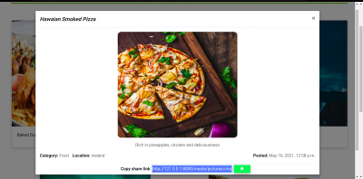
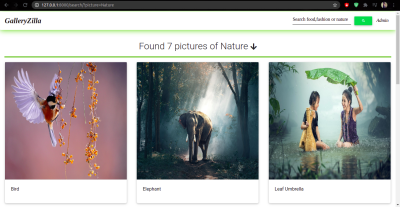
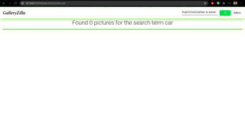
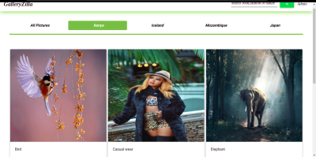
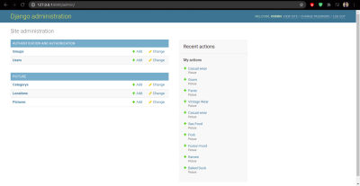

# GalleryZilla 

## Author
 [Alvynah Wabwoba](https://github.com/alvynah)

# Description
This is a Django web application. It is a photo gallery  where a user can view different photos based on locations they were taken, search the photos by categories they belong to and copy the photo link to share with others.The admin is the one who populates the database.

## Screenshot
1. Landing page

    

2. Image modal

    

3. Search by category(nature) 

    
    
    

4. View by Location (Kenya)

    

5. Admin view

    

## Live Link
[GalleryZilla](https://galleryzilla.herokuapp.com/)
## User Story

1. View different photos that interest them
2. Click a single image to expand it and view the details of that photo
3. Search for different categories
4. Copy a link to the photo to share with my friends.
5. View photos based on the location they were taken.

## Behaviour Driven Development (BDD)

1. View by Location

|Behaviour 	           |    Input 	                 |       Output          |
|----------------------------------------------|:-----------------------------------:|-----------------------------:|       
| Click on the location you want from the tabs in the landing page  | location| Only images from that location are displayed  | 

2. Search by Category 

|Behaviour 	           |    Input 	                 |       Output          |
|----------------------------------------------|:-----------------------------------:|-----------------------------:|       
| Enter a search category on the search form   | searchTerm| Images that belong to that category are displayed  | 

3. Admin View

|Behaviour 	           |    Input 	                 |       Output          |
|----------------------------------------------|:-----------------------------------:|-----------------------------:|       
| Click on Admin on navigation bar | Username, Password| User is redirected to the admin page where they can manage the database  |  

4. Copy Image Link

|Behaviour 	           |    Input 	                 |       Output          |
|----------------------------------------------|:-----------------------------------:|-----------------------------:|       
| Click on the copy icon on the image modal that appears after clicking on the image | copy link| The image link is copied to clipboard  |  

## Setup/Installation Requirements
### Getting the code
1. clone repository
    https://github.com/alvynah/GalleryZilla.git
    
2. Move to the folder and install requirements
    cd gallery
    pip install -r requirements.txt
### Database

1. Set up Database,and put your username and password in the code

2. Make migrations
    python3 manage.py makemigrations picture

3. Migrate
   python3 manage.py migrate 
    
### Running the Application
1. Run main apllication
   * python3 manage.py runserver

2. Run tests
    
   * python3.6 manage.py test picture

## Technologies Used

* Python3.6
* Django 3.2
* Bootstrap
* PostgreSQL
* CSS
* Heroku

## Contact Information
For any further inquiries or contributions or comments, reach me at [Alvynah](juvatalvynah@gmail.com)
### License
[MIT License](https://github.com/alvynah/GalleryZilla/blob/main/LICENSE)

Copyright (c) 2021 **Alvynah Wabwoba**